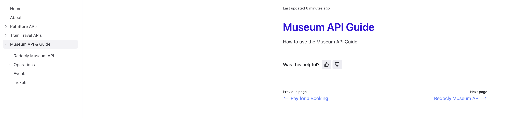
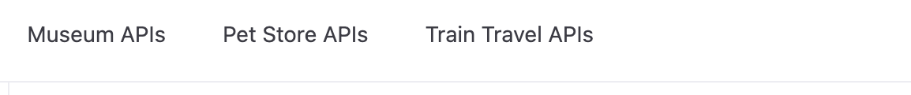
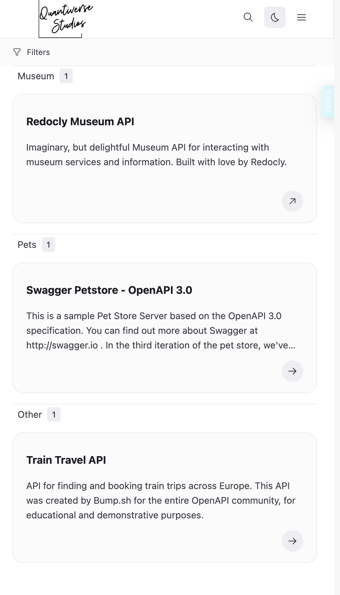

# Decision making process and screenshots

A review of options for sidebar vs navigation vs catalog.

## Sidebar view

The side bar view is a very typical breakdown of a left navigation which a user would most likely have experienced before. It's not clear how this would 
scale with a large number of specs.

## Top nav

This option may be useful with a small number of specs but I cannot see this view scaling well with many specs.

## Catalog

The catalog option is a good option for allowing users to navigate API's that are not necessarily related (IMO)
Allows for scalability as only after selecting the spec would the use then navigate through the relevant options available to them.

