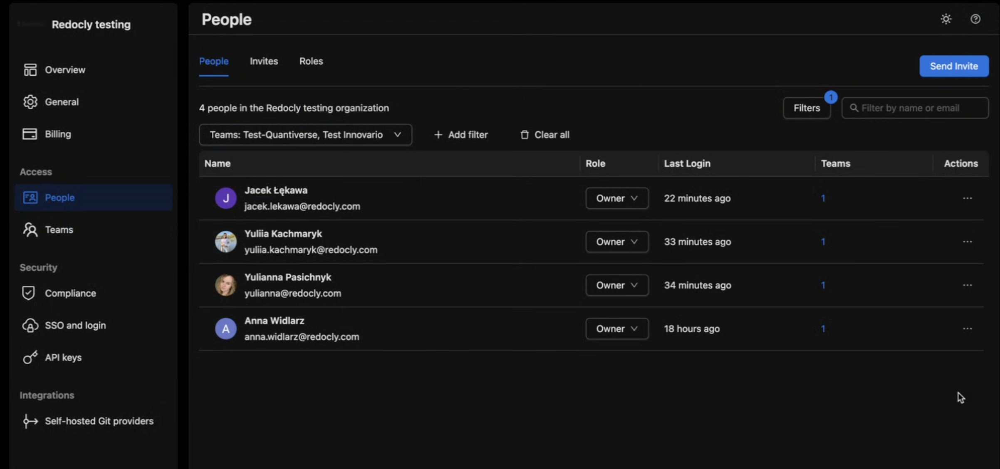
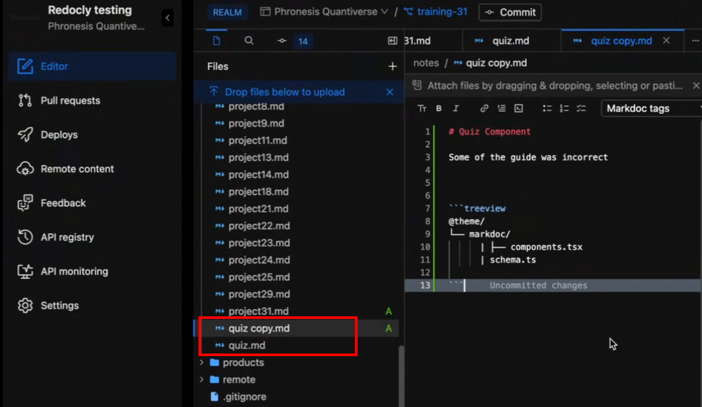
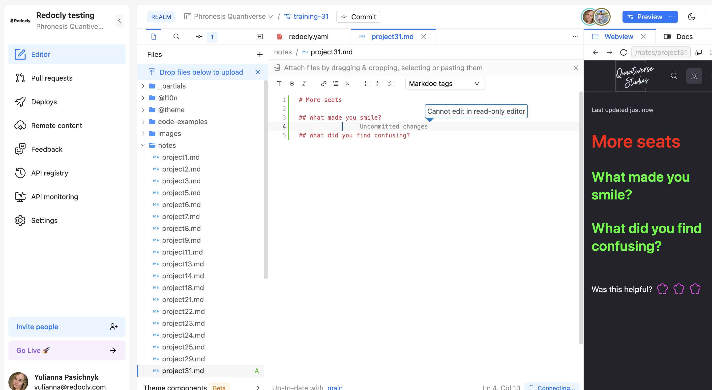
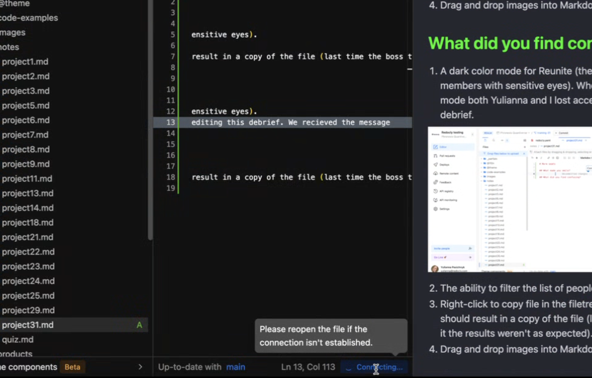
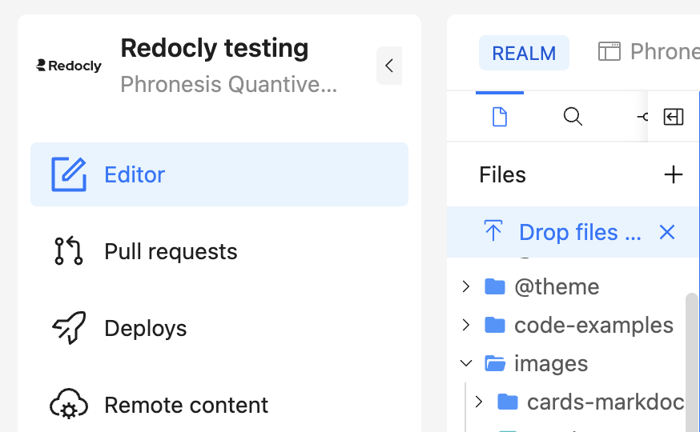
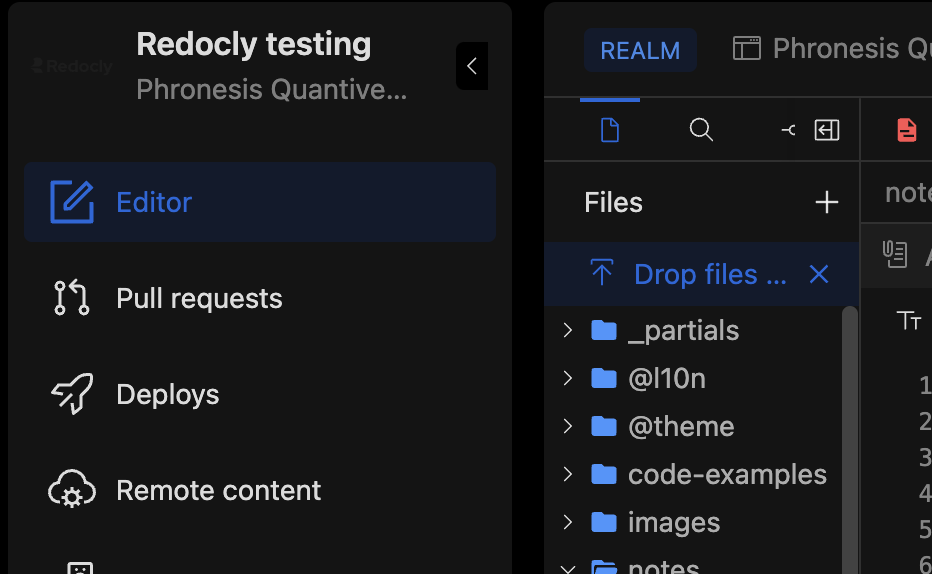
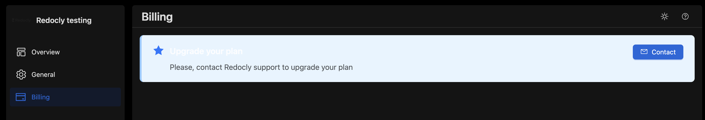
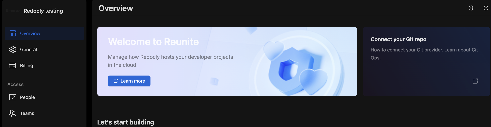
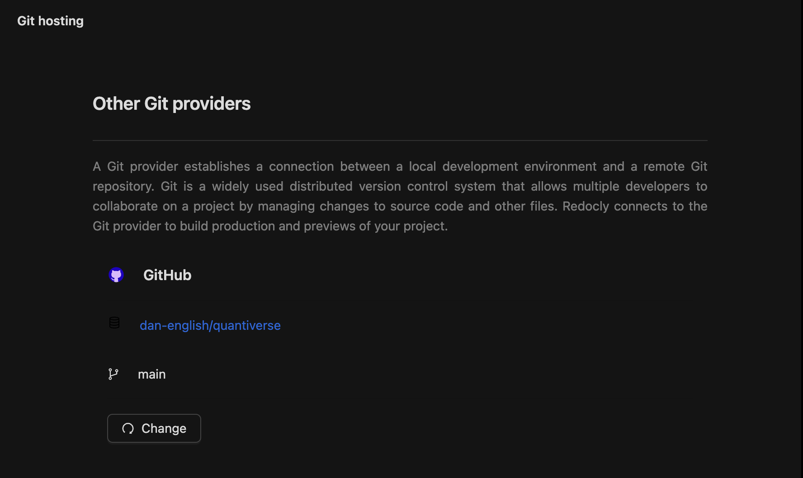
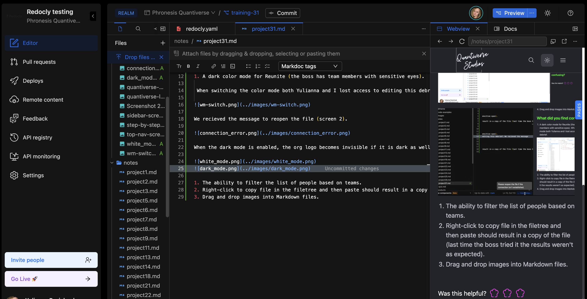

# More seats

## What made you smile?

1. A dark color mode for Reunite (the boss has team members with sensitive eyes).

It exists :) 

2. The ability to filter the list of people based on teams.

The Teams filter is working perfectly. However, we suggest adding the Team name when two Teams are selected to clearly show which members belong to each team.

3. Right-click to copy file in the filetree and then paste should result in a copy of the file (last time the boss tried it the results weren't as expected).

The copy-paste is working as expected.

4. Drag and drop images into Markdown files.

It works perfectly fine (this is how we were adding all images to this debrief)
            
## What did you find confusing?

1. A dark color mode for Reunite (the boss has team members with sensitive eyes).

 When switching the color mode both Yulianna and I lost access to editing this debrief. 

Afterwards, we recieved the message to reopen the file.

When the dark mode is enabled, the org logo becomes invisible if it is dark as well. We need to consider this (maybe have setting for the organizarion logo)

Dark mode on Billing page:

The banner on the Overview page shall also be adjusted.

The icon `Settings -> Git hosting`:

 

Webview was not autoupdating... We had to restart it multiple times to see our collaborative edits, our own edits, etc. 

