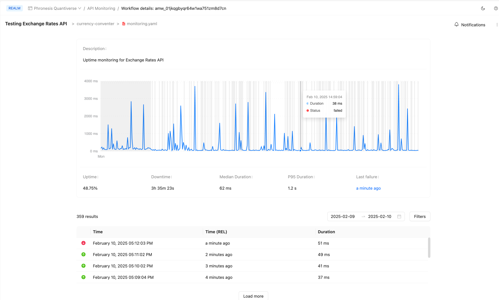

# Monitoring currency API

## What made you smile?

We managed to make it working and gather the uptime. In our case during 5 hours of monitoring, the uptime is 48.75%

## What did you find confusing?

1. The documentation is not always clear. Having no step-by-step guidance makes it difficult for the average user to set up the monitoring. 
2. We had an issue with naming convention of API key: first we named it as API_KEY, which aparenty (and maybe) was causing the issue. Renaming to CURRENCY_API_KEY helped. Before that we were constanly getting "Unathorithed" error.
3. It was not easy to understand how and where to create the arazzo file for monitoring.
4. It is somewhat confusing to understand the error message in checks: what is the criteria? 

*Success criteria check*
*Checking simple criteria: {"condition":"$statusCode == 200"}*

In overal that was not an easy one.