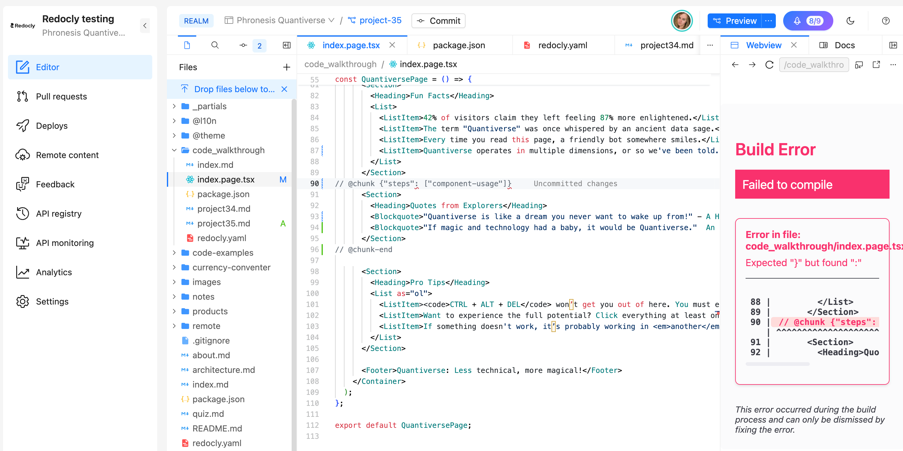

# Code walkthrough filters

## What made you smile?

We managed to make it working and creating the filters was pretty much easy.

## What did you find confusing?

We noticed the the chunks for the React page is not working when trying to create it for the JavaScript/HTML syntax.
The error below was shown when we wanted to highlight Section and we couldn't overcome it.

